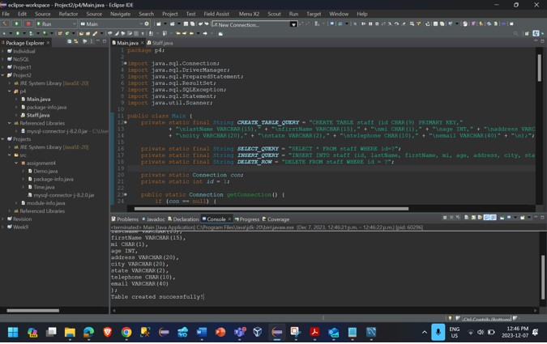

# java_SQL

# Managing a staff database, allowing admin to create, insert, update, and delete staff records

## Design
**Technology used**
- MySQL Workbench
- Eclipse Java
- Microsoft visio

**Pseudocode to outline all steps in solving the problem**

Creating a flow diagram in text form can be challenging due to its visual nature, but I can provide a simplified description of the flow in a text-based representation. You can use this as a basis to create a visual flowchart using a diagramming tool. Here's a textual representation:

**Start:**
   - Print "Hello World!"

**Database Connection:**
   - Check if the database connection (`con`) is null.
   - If null:
      - Load JDBC Driver
      - Connect to MySQL Database ("jdbc:mysql://localhost/p2", "root", "2014")
      - Print "Success"
   - Continue to the next step.

**User Input and Create Table:**
   - Prepare the SQL statement for table creation (`CREATE_TABLE_QUERY`).
   - Execute the SQL statement to create the `staff` table.

**Print Table Creation Status:**
   - Print "Table created successfully!"

**User Input and Insert:**
   - Get user input for the following:
      - `lastName`
      - `firstName`
      - `mi`
      - `age`
      - `address`
      - `city`
      - `state`
      - `telephone`
      - `email`
   - Prepare the SQL statement for insertion (`INSERT_QUERY`).
   - Execute the SQL statement to insert values into the `staff` table.

**Print Insertion Status:**
   - Print "Values inserted successfully!"

**User Input and Select:**
   - Get user input for the `id` to select.
   - Prepare the SQL statement for selection (`SELECT_QUERY`).
   - Execute the SQL statement to select and display records.

**Print Selected Records:**
   - Print the selected records.

**User Input and Delete:**
   - Get user input for the `id` to delete.
   - Prepare the SQL statement for deletion (`DELETE_ROW`).
   - Execute the SQL statement to delete the record.

**Print Deletion Status:**
    - Print "Row deleted successfully!" or "No row found with ID: [id]"

**End:**
    - End the program.

2.	**Create a UML class diagram for the Staff class.**

 

**Code/Implementation: **

Copy and paste the entire contents of all code created here.

      package p4;

      import java.sql.Connection;
      import java.sql.DriverManager;
      import java.sql.PreparedStatement;
      import java.sql.ResultSet;
      import java.sql.SQLException;
      import java.sql.Statement;
      import java.util.Scanner;

      public class Main {
          // SQL Queries
          private static final String CREATE_TABLE_QUERY = "CREATE TABLE staff (id CHAR(9) PRIMARY KEY,"
                  + "\nlastName VARCHAR(15)," + "\nfirstName VARCHAR(15)," + "\nmi CHAR(1)," + "\nage INT," + "\naddress VARCHAR(20),"
                  + "\ncity VARCHAR(20)," + "\nstate VARCHAR(2)," + "\ntelephone CHAR(10)," + "\nemail VARCHAR(40)" + "\n);";

    private static final String SELECT_QUERY = "SELECT * FROM staff WHERE id=?";
    private static final String INSERT_QUERY = "INSERT INTO staff (id, lastName, firstName, mi, age, address, city, state, telephone, email) VALUES (?,?,?,?,?,?,?,?,?,?)";
    private static final String DELETE_ROW = "DELETE FROM staff WHERE id = ?";

    // Database connection and initial ID
    private static Connection con;
    private static int id = 2;

    // Establishes a connection to the database
    public static Connection getConnection() {
        if (con == null) {
            try {
                Class.forName("com.mysql.cj.jdbc.Driver");
                con = DriverManager.getConnection("jdbc:mysql://localhost/p2", "root", "password");
                System.out.println("Success");
            } catch (ClassNotFoundException | SQLException ex) {
                ex.printStackTrace();
            }
        }
        return con;
    }

    // Creates the staff table in the database
    public void createTable() {
        try (Connection con = getConnection(); Statement s = con.createStatement()) {
            s.execute(CREATE_TABLE_QUERY);
        } catch (SQLException e) {
            e.printStackTrace();
        }
        System.out.println("Table created successfully!");
    }

    // Inserts values into the staff table based on user input
    public void insertValues() {
        try (Connection con = getConnection(); PreparedStatement ps = con.prepareStatement(INSERT_QUERY);
             Scanner sc = new Scanner(System.in)) {
            ps.setInt(1, id);
            System.out.println("Enter lastname");
            ps.setString(2, sc.next());
            System.out.println("Enter firstname");
            ps.setString(3, sc.next());
            System.out.println("Enter mi");
            ps.setString(4, sc.next());
            System.out.println("Enter age");
            ps.setInt(5, sc.nextInt());
            sc.nextLine(); // Consume the newline character
            System.out.println("Enter address");
            ps.setString(6, sc.nextLine());
            System.out.println("Enter city");
            ps.setString(7, sc.nextLine());
            System.out.println("Enter state");
            ps.setString(8, sc.next());
            System.out.println("Enter your telephone number");
            ps.setString(9, sc.next());
            System.out.println("Enter email");
            ps.setString(10, sc.next());
            ps.executeUpdate();
        } catch (SQLException e) {
            e.printStackTrace();
        }
        System.out.println("Values inserted successfully!");
    }

    // Selects and displays staff information based on user input ID
    public void selectID() {
        try (Connection con = getConnection(); PreparedStatement ps = con.prepareStatement(SELECT_QUERY);
             Scanner sc = new Scanner(System.in)) {
            System.out.println("Enter ID to select:");
            int id = sc.nextInt();
            ps.setInt(1, id);
            ResultSet rs = ps.executeQuery();

            while (rs.next()) {
                int id1 = rs.getInt("id");
                String lastname = rs.getString("lastname");
                String firstname = rs.getString("firstname");
                String mi = rs.getString("mi");
                int age = rs.getInt("age");
                String address = rs.getString("address");
                String city = rs.getString("city");
                String state = rs.getString("state");
                String telephone = rs.getString("telephone");
                String email = rs.getString("email");

                System.out.println("id: " + id1 + "\nFirstname: " + firstname + "\nLastname: " + lastname + "\nMi: " + mi
                        + "\nAge: " + age + "\nAddress: " + address + "\nCity: " + city + "\nState: " + state
                        + "\nTelephone: " + telephone + "\nEmail: " + email);
            }

        } catch (SQLException e) {
            e.printStackTrace();
        }
    }

    // Deletes a staff record based on user input ID
    public void deleteQuery() {
        try (Connection con = getConnection(); PreparedStatement ps = con.prepareStatement(DELETE_ROW);
             Scanner sc = new Scanner(System.in)) {
            System.out.println("Enter ID to delete:");
            int id = sc.nextInt();
            ps.setInt(1, id);
            int rowsAffected = ps.executeUpdate();

            if (rowsAffected > 0) {
                System.out.println("Row deleted successfully!");
            } else {
                System.out.println("No row found with ID: " + id);
            }
        } catch (SQLException e) {
            e.printStackTrace();
        }
    }

    // Main method to execute the program
    public static void main(String[] args) {
        System.out.println("Hello world!");

        Main main = new Main();
        getConnection();
        System.out.println("Create Table Query:\n" + CREATE_TABLE_QUERY);
        main.createTable();
        main.insertValues();
        main.deleteQuery();
        main.selectID();
    }
    }

**Testing:**

Include screenshots to show the operation of each of the menu options.

**Before creating table: staff**
MySQL page before running the program

**Create table**:

**Insert values**:

 

**Select**:

**Delete**:

**Exception when State does not conform with two-character limit**:

 

**Exception when Mi(middle initials) does not conform with one-character limit:**:

 
